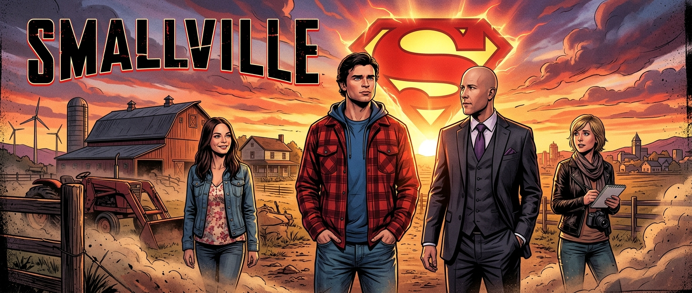

# Smallville: Mreža Veza i Klastera

## O Projektu
**Smallville: Mreža Veza** je interaktivni alat za vizualizaciju kompleksnih odnosa između likova iz popularne serije *Smallville*. Ovaj projekt koristi grafove snaga (force-directed graphs) kako bi prikazao kako su Clark Kent, Lex Luthor i ostali stanovnici Smallvillea povezani kroz prijateljstva, rivalstva i obiteljske veze.

## Ključne Značajke
- **Interaktivna Mapa:** Povlačite i istražujte likove u realnom vremenu.
- **Klasterizacija:** Likovi su grupirani po pripadnosti (Obitelj Kent, Luthors, Justice League, Kriptonci).
- **Detaljni Odnosi:** Svaka poveznica (link) opisuje specifičnu vrstu odnosa i njegovu snagu.
- **Dinamičko Dodavanje:** Sami dodajte nove likove ili stvarajte nove veze unutar mape.
- **Pretraga:** Brzo pronađite omiljenog heroja ili zlikovca.

## Tehnologije
Aplikacija je izgrađena koristeći moderne web tehnologije:
- **React 19**
- **Vite** (za munjevit razvoj)
- **react-force-graph-2d** (za vizualizaciju mreže)
- **Tailwind CSS** (za moderan i taman dizajn)
- **Framer Motion** (za glatke animacije sučelja)

## Kako Koristiti
1. **Istraživanje:** Kliknite na bilo koji čvor (lik) kako biste ga centrirali i vidjeli dodatne informacije.
2. **Dodavanje Ljudi:** Koristite bočnu traku s lijeve strane za unos novih imena i grupa.
3. **Povezivanje:** Odaberite dva lika iz padajućeg izbornika i stvorite novu vezu između njih.
4. **Pretraživanje:** Unesite ime u tražilicu kako biste filtrirali listu likova.

---
*Izrađeno s ljubavlju za fanove Smallvillea.*
