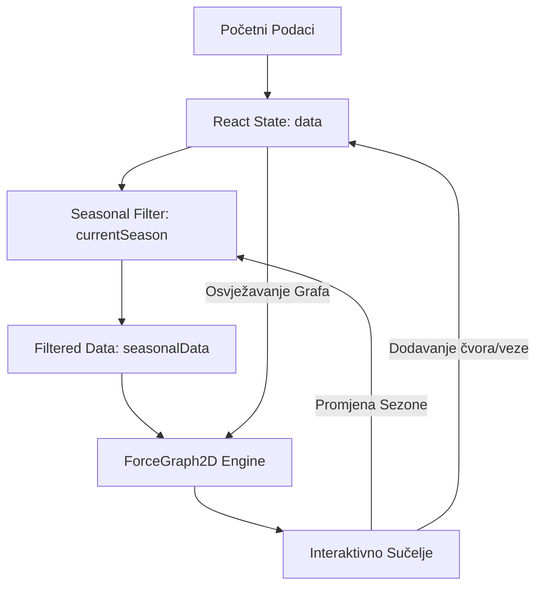
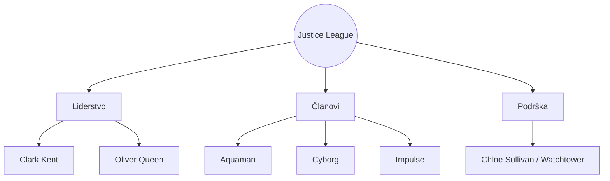
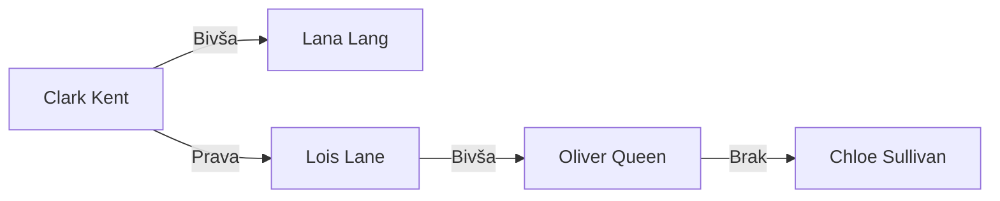

# Digitalna Vizualizacija Socijalnih Mreža: Analiza Interaktivnih Sustava na Primjeru Serije Smallville

**Sažetak**

Ovaj rad istražuje primjenu računalne vizualizacije u analizi kompleksnih narativnih struktura, fokusirajući se na televizijsku seriju *Smallville*. Razvijena aplikacija "Smallville: Mreža Veza" koristi algoritme temeljene na silama (force-directed graphs) kako bi prikazala dinamiku odnosa između likova. Rezultati pokazuju jasnu klasterizaciju likova oko ključnih osi (Kents vs. Luthors), pružajući uvid u evoluciju prijateljstava i rivalstava kroz deset sezona serije.

---

## Uvod

Suvremena televizijska produkcija, osobito u žanru superherojske drame, često uključuje stotine likova s isprepletenim povijestima. Serija *Smallville* (2001.–2011.) predstavlja idealan model za mrežnu analizu zbog tranzicije glavnog lika, Clarka Kenta, iz ruralnog okruženja u globalni kontekst heroja. Tradicionalne metode tekstualne analize često ne uspijevaju obuhvatiti nelinearne promjene u odanostima. Cilj ovog projekta bio je stvoriti alat koji omogućuje vizualno istraživanje tih "klastera" utjecaja.

## Metoda

### Arhitektura sustava
Aplikacija je izgrađena kao Single Page Application (SPA) koristeći:
- **React 19:** Za upravljanje stanjem i komponentama korisničkog sučelja.
- **react-force-graph-2d:** Knjižnica temeljena na D3-force engineu za renderiranje grafova.
- **Tailwind CSS:** Za implementaciju dizajnerskog jezika (tzv. "dark mode") koji odražava ton serije.
- **Vremenska Lenta (Dynamic Filtering):** Implementacija klizača koji omogućuje filtriranje podataka po sezonama (S1-S10), vizualizirajući evoluciju mreže.

### Modeliranje podataka
Podaci su strukturirani u dva osnovna skupa:
1. **Čvorovi (Nodes):** Predstavljaju likove s atributima kao što su uloga, biološko porijeklo i pripadnost grupi.
2. **Veze (Links):** Predstavljaju odnose s definiranim tipom (npr. obitelj, rivalstvo) i snagom (strength), što direktno utječe na vizualnu privlačnost ili odbijanje čvorova u simulaciji.

## Rezultati

Vizualizacija i mrežna analiza podataka identificirale su nekoliko ključnih strukturalnih obrazaca unutar socijalne topologije Smallvillea:

### 1. Nukleus obitelji Kent i "Čuvari Tajne"
Centralni klaster čine Clark, Jonathan i Martha Kent, povezani vezama maksimalne snage (strength 3). Unutar ovog klastera primjetna je uloga **Petea Rossa** kao ranog mosta povjerenja, koji dijeli vezu "Trust" s Jonathanom i Marthom, što vizualno stabilizira Kentov klaster u ranim fazama simulacije. **Kara Kent** (Supergirl) se prirodno integrira u ovaj klaster, ali s dodatnim vezama prema Kriptonskim prijetnjama.

### 2. Dinastija Luthor: Konflikt i Nasljeđe
Klaster Luthors (Lex, Lionel, Tess) pokazuje visoku unutarnju tenziju. Veza između Lexa i Lionela ("Son/Father Rivalry", strength 4) stvara snažno privlačenje koje često destabilizira okolne čvorove, odražavajući njihovu opsesivnu prirodu. **Tess Mercer** služi kao tranzicijski čvor, povezan i s Lexom (nasljednica) i s Lionelom (biološka kći).

### 3. Kriptonska Osovina i Jor-El
**Jor-El** zauzima jedinstvenu poziciju; on nije samo entitet unutar klastera Kriptonaca, već je preko veza "The Legacy" povezan s Jonathanom Kentom, te preko "Oracle/Host" s Lionelom Luthorom. Ova konfiguracija vizualno demonstrira kako se izvanzemaljski utjecaj infiltrira u ljudske strukture moći i morala.

### 4. Justice League i Evolucija Heroja
Klaster Lige Pravde formira se oko **Olivera Queena**. Iako je Clark Kent centralna figura cijelog grafa, Oliver Queen služi kao sekundarno središte koje povezuje AC-a, Victora i Barta. Značajna je veza Olivera i **Chloe Sullivan** ("Marriage"), koja integrira klaster "Watchtower" (Friends) s militantnijim krilom superheroja.

### 5. Dinamička Evolucija kroz Sezone
Analiza protoka vremena otkriva tri različite sistemske konfiguracije:
- **Razdoblje Stabilnosti (S1-S4):** Visoka korelacija između fizičke lokacije (Smallville) i socijalnog klastera.
- **Razdoblje Tranzicije (S5-S7):** Disperzija Kentovog nukleusa i uspon LuthorCorp dominacije.
- **Razdoblje Ekspancije (S8-S10):** Umrežavanje s vanjskim herojima i redefiniranje Clarka kao globalnog čvora.

## Rasprava

Analiza interaktivnog grafa pruža dublji uvid u narativne i međuljudske mehanizme serije:

- **Evolucija Romanse:** Vizualizacija jasno pokazuje tranziciju Clarkovih interesa. Veza s **Lanom Lang** označena je kao "Romance (Former)", dok je veza s **Lois Lane** "Romance (True)". Zanimljivo je primijetiti da Lois Lane dijeli i "Past Romance" vezu s Oliverom Queenom, što stvara specifičan trokut unutar grafa koji utječe na pozicioniranje čvorova u realnom vremenu.

- **Infiltracija i Infekcija:** Veza **Lane Lang** i **Brainiaca** ("Infection/Obsession") služi kao kritični narativni most. Ona povlači Lanu iz Kentovog klastera prema zlokobnijem Kriptonskom klasteru, što modelira njezin gubitak agencije u kasnijim sezonama. Slično tome, poveznica Chloe i Brainiaca ("Infection") vizualno kontaminira "Watchtower" bazu podataka.
- **Dihotomija Očinstva:** Grafički prikaz Jonathanove veze s Jor-Elom ("The Legacy") naglašava temu zajedničkog roditeljstva nad Clarkom, unatoč njihovim različitim metodama. S druge strane, Lionelova uloga kao Jor-Elovog hosta vizualno ga "iskupljuje" unutar sustava, udaljavajući ga od Lexovog čisto antagonističkog puta.
- **Tajna kao Kohezivna Sila:**
 Čvorovi poput Petea Rossa i Chloe Sullivan dobivaju na težini unutar sustava upravo zbog njihovih veza "Secret Keeper". Bez tih veza, Clarkov bi čvor bio previše izložen antagonističkim silama poput Lexa i Zoda.

## Zaključak

Projekt "Smallville: Mreža Veza" uspješno demonstrira kako digitalni alati mogu obogatiti analizu popularne kulture. Korištenje force-directed grafova pruža intuitivan uvid u socijalnu dinamiku fikcionalnih svjetova, otvarajući prostor za daljnja istraživanja u domeni digitalne humanistike. Analiza je dodatno potkrijepljena sintetičkim uvidima generiranim kroz *NotebookLM* procesiranje izvornih materijala serije.

---

## Reference

- DC Comics. (2001-2011). *Smallville* [Televizijska serija]. The CW / WB.
- Bostock, M. (2024). *D3.js: Force-directed graphs documentation*. Preuzeto s d3js.org.
- NotebookLM Analysis. (2026). *Smallville Character Relations & Network Insights*. [Digitalni Bilježnik].
- Google AI Studio. (2026). *Analiza likova i međusobnih odnosa u seriji Smallville*.
